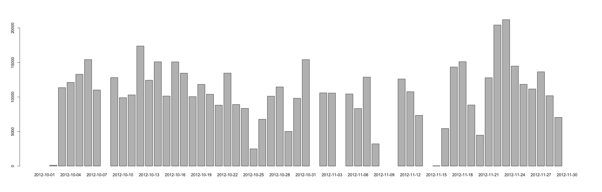
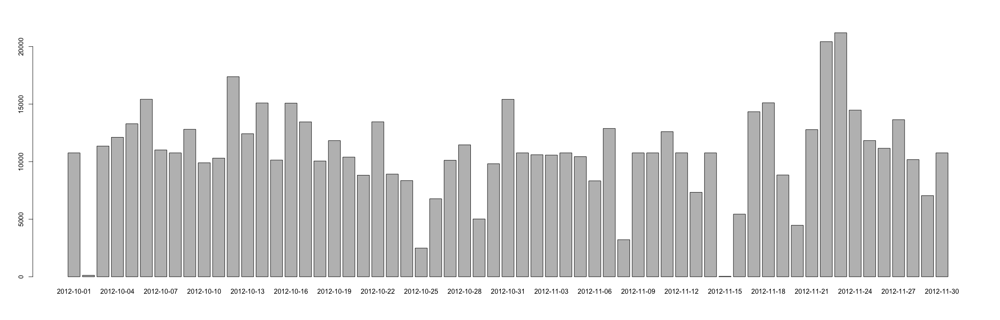

# Reproducible Research: Peer Assessment 1


## Loading and preprocessing the data

After unpacking the ```activity.zip``` import the data


```r
data <- read.csv('activity.csv',
                 head = TRUE,
                 na.strings='NA',
                 sep=',',
                 colClasses=c("integer",
                              "character",
                              "integer"))
```

Also, we need to prepare data:
1. Add leading zeros to the interval col

```r
data$interval <- lapply(data$interval, function(x) { sprintf("%04d", x)})
```
2. Add ```datetime``` column with parced time:

```r
data$datetime <- as.POSIXct(paste(data$date, data$interval), format="%Y-%m-%d %H%M")
```

## What is mean total number of steps taken per day?

The day totals can be obtained as

```r
totals <- aggregate(data$steps, by=list(data$date), sum)
```

And histogram will look like:

```r
barplot(totals$x, names.arg = totals$Group.1)
```

 
The **mean** without N/A values is

```r
mean(totals$x, na.rm=TRUE)
```

```
## [1] 10766.19
```
The **median** without N/A values is

```r
median(totals$x, na.rm=TRUE)
```

```
## [1] 10765
```

## What is the average daily activity pattern?

Select interval values:

```r
interval <- unlist(unique(data$interval))
intervals <- data.frame(interval)
intervals$avg <- lapply(intervals$interval,
                        function(x) {
                            mean(data[data$interval == x,]$steps,
                               na.rm=TRUE)
                          }
                        )
intervals$avg <- unlist(intervals$avg)
```

Draw the plot with avarage value across all days (as abline):

```r
plot(intervals$avg, type='l', xaxt="n")
axis(1, labels=intervals$interval, at=c(1:length(intervals$interval)))
abline(h=mean(intervals$avg))
```

 

The maximum avg number of steps can be detected

```r
with(intervals, interval[avg== max(avg)])
```

```
## [1] 0835
## 288 Levels: 0000 0005 0010 0015 0020 0025 0030 0035 0040 0045 0050 ... 2355
```
which is the interval in a day with maximum average

## Imputing missing values

The total count of missing (NA) values is

```r
length(data$steps[is.na(data$steps)])
```

```
## [1] 2304
```

We will clone original data

```r
mdata <- data.frame(data)
```
And replace NA values with avarage in the time interval

```r
mdata$steps <- round(unlist(apply(
  mdata,
  1,
  function(x) {
    if (is.na(x[1])) intervals$avg[intervals$interval == x[3]] else x[1]
    }
  )))
```

And finally there is the totals chart with restored NAs:

```r
mtotals <- aggregate(mdata$steps, by=list(mdata$date), sum)
```

```r
barplot(mtotals$x, names.arg = mtotals$Group.1)
```

 
The **mean** is

```r
mean(mtotals$x)
```

```
## [1] 10765.64
```
The **median** is

```r
median(mtotals$x)
```

```
## [1] 10762
```
*Median and mean values are a bit lower, but overall impact on averages and estimates is not significant.*

## Are there differences in activity patterns between weekdays and weekends?

Define day names and factor:

```r
mdata$dayname <-weekdays(mdata$datetime)
mdata$daytype <-factor(
  apply(
    mdata,
    1,
    function(x) {
      if (x['dayname'] == "Sunday" || x['dayname'] == "Saturday") "weekend" else "weekday"
      }
    )
  )
levels(mdata$daytype)
```

```
## [1] "weekday" "weekend"
```

Collect avg daya for weekdays and weekends:

```r
intervals$avg_we <- unlist(lapply(intervals$interval,
                        function(x) {
                            mean(mdata[mdata$interval == x & mdata$daytype == 'weekend',]$steps)
                        }
))
intervals$avg_wd <- unlist(lapply(intervals$interval,
                        function(x) {
                            mean(mdata[mdata$interval == x & mdata$daytype == 'weekday',]$steps)
                        }
))
```

Comparison plot will be:

```r
par(mfrow=c(2,1), mar=c(2,4,0,0))
plot(intervals$avg_wd, type='l', xaxt="n", ylab="Week Day averages", xlab='')
plot(intervals$avg_we, type='l', xaxt="n", ylab="Week End averages", xlab='')

axis(1, labels=intervals$interval, at=c(1:length(intervals$interval)))
```

 
